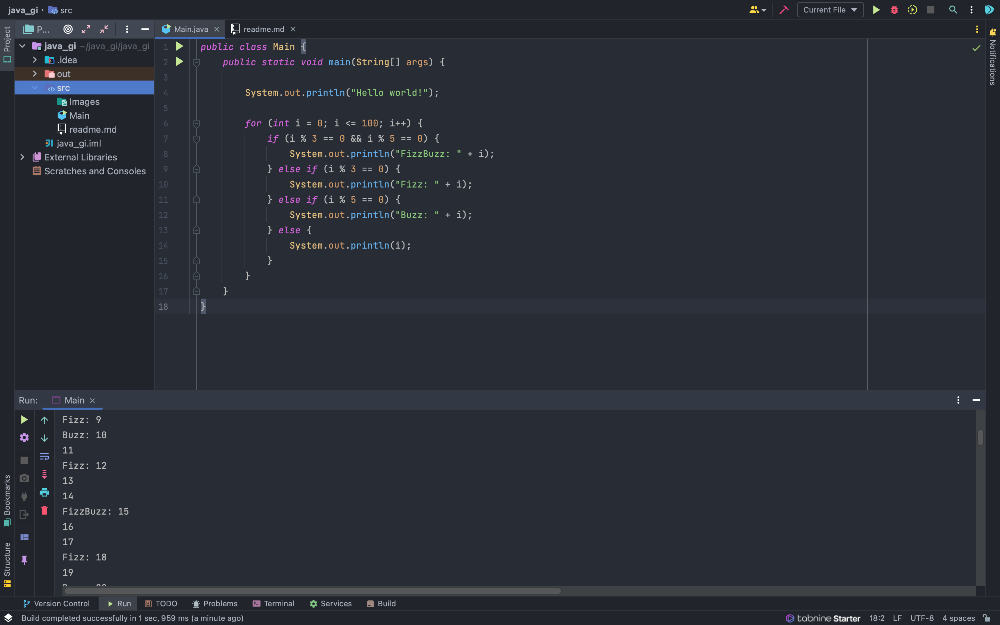

# Java Guided Inquiry

## Software Engineer / Creator
- Jorge L
- Road To Hire Program 2022

### **Java Oracle Badge / Certificate**

### **For Loop w/ Jave**

Solve this in Java. Print integers 1 to 100, 
but print “Fizz” if an integer is divisible by 3, 
“Buzz” if an integer is divisible by 5, 
and “FizzBuzz” if an integer is divisible by both 3 and 5.

